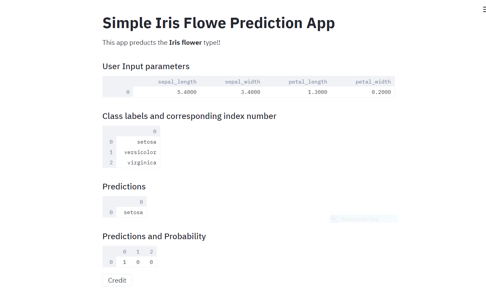
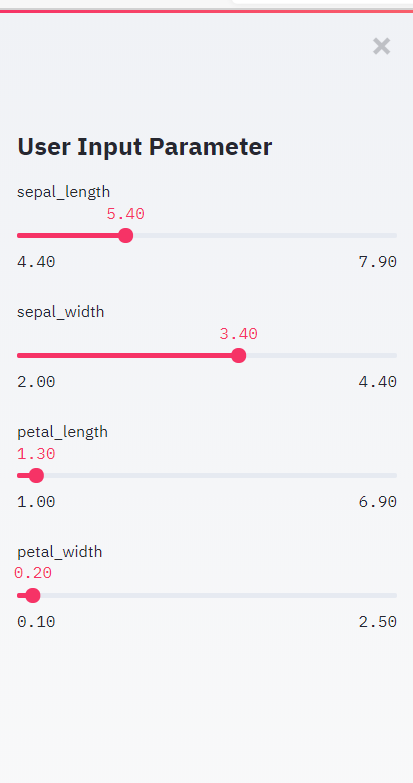
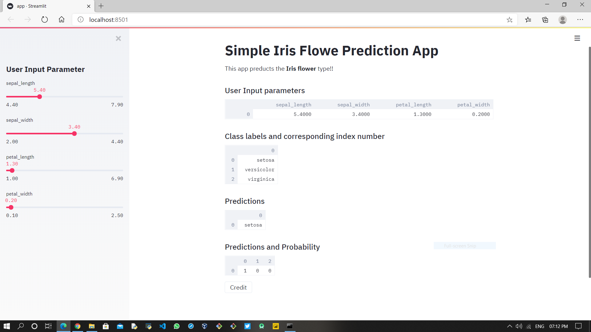

## iris ml app

This app classifies , to which category the iris flower belongs to , provided some input parameters

## Snapshots

The above snapshot describes the output for given input parameters

The above snapshot describes the data driven input parameter 

The above snapshot is overall look of the app